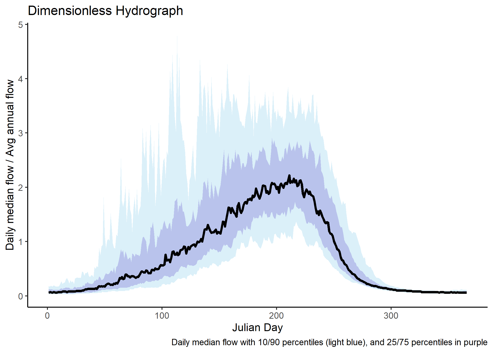

# Simple Functional Flows Calculator API client
This package is designed to:
1. Process data through the online functional flows calculator
2. Transform that data and return plots of the Dimensionless Reference Hydrograph (DRH) as well as boxplots showing
  the observed versus predicted percentile values for each metric.
3. Have shortcut functions that handle all of this, while exposing the internals so you can access useful intermediate
  products, such as the functional flows calculator results as an R dataframe, in case you need to do more
  complex analysis.
  
It is meant to be used with simply a gage ID, or with a timeseries dataframe of flows along with either a stream
segment COMID or longitude and latitude (it will look up the COMID for you). See Setup and Examples below for more.

[](https://travis-ci.org/ceff-tech/ffc_api_client)

1. [Documentation](#full-documentation)
2. [Setup](#setup)
3. [Usage Examples](#usage-examples)
4. [Predicted Flow Metrics](#predicted-flow-metrics)
6. [Change Log](#change-log)


## Full Documentation
There are many examples below, including instructions on how to set up and use the core parts of the package.
However, full documentation of the package is included only in the [online documentation](https://ceff-tech.github.io/ffc_api_client/reference/index.html) or in the [PDF manual](./manuals/ffcAPIClient_latest.pdf).

## Setup
1. If you don't already have `devtools` installed, run `install.packages('devtools')`
in your R console, or install the package any way you prefer.
2. Install this package with `devtools::install_github('ceff-tech/ffc_api_client/ffcAPIClient')`
3. Now we need to retrieve your token. In Firefox or Chrome, log into https://eflows.ucdavis.edu. Once logged in, press F12 on your keyboard to bring up the Inspector, then switch to the Console tab.
4. In the console, type `localStorage.getItem('ff_jwt')` - you may need to type it in yourself instead of pasting (or follow Firefox's
instructions to enable pasting - it will tell you how after you try to paste). Hit Enter to send the command. 
5. Your browser will place text on the line below the command you typed - this is your "token". Save this value and copy it to your clipboard and we'll use it below. This value should stay private - if other people knew the value, they could use it to access your account on eflows.ucdavis.edu!

That's it. You can now run data through the ffc using the online calculator. Make sure to give each run a unique name for this
code to work correctly!

## Usage Examples

### Easy-mode examples
```r
# If you have a gage and a token, you can get all results simply by running
ffcAPIClient::evaluate_gage_alteration(gage_id = 11427000, token = "your_token", plot_output_folder = "C:/Users/youruser/Documents/NFA_Gage_Alteration")
# output_folder is optional. When provided, it will save plots there. It will show plots regardless.

# If you have a data frame with flow and date fields that isn't a gage, you can run
ffcAPIClient::evaluate_alteration(timeseries_df = your_df, token = "your_token", plot_output_folder = "C:/Users/youruser/Documents/Timeseries_Alteration", comid=yoursegmentcomid)
# it also *REQUIRES* you provide either a comid argument with the stream segment COMID, or both
# longitude and latitude arguments.
# If your dates are in a different format, provide the format string as argument date_format_string

```
Both of these functions plot results immediately and optionally save the plots to the output folder. They
also return a list with keys `ffc_results_df`, `percentiles`, and `drh`, so you can access the transformed
data directly for additional calculations.
* `ffc_results_df` includes the raw data from the functional flows calculator for each flow metric by 
   day of water year. 
* `percentiles` includes the calculated 10th, 25th, 50th, 75th, and 90th percentiles for each metric
* `drh` contains the raw DRH data with columns for percentiles and rows for days of water year.

### Examples Using the DRH Only

```r
# Initialize a Run
test_data <- example_gagedata()  # just get some fake gage data - based on Daniel Philippus' code - you can build your own data frame here
ffcAPIClient::set_token(YOUR_TOKEN_VALUE_IN_QUOTES) # you'll need to get your own of this - see above
results <- ffcAPIClient::get_ffc_results_for_df(test_data)  # send it to the FFC online to process

# Retrieve Results and Plot
## get the DRH data as a data frame with percentiles for columns and days for rows
drh_data <- ffcAPIClient::get_drh(results) 
plot(drh_data$seventy_five, type="l")  # plot the seventy-fifth percentile DRH
```

### Retrieve, calculate, and plot a USGS gage
This example retrieves USGS gage data, runs it through the FFC online, and plots the DRH nicely
```r
# don't forget to set your token first if you haven't already
ffcAPIClient::set_token(YOUR_TOKEN_VALUE_IN_QUOTES) # you'll need to get your own of this - see above

# retrieves flow data for North Fork American gage and sends it through the FFC
results <- ffcAPIClient::get_ffc_results_for_usgs_gage(11427000)  
drh_plot <- ffcAPIClient::plot_drh(results)  # includes optional output_path argument to save to file automatically
drh_plot  # display the plot

```


There is quite a bit more functionality available that we're working on documenting here and in the package still. Look for that soon!

## Predicted Flow Metrics
This package compares the percentiles generated from the observed data
and the percentiles predicted by modeling. As part of this functionality, the code includes the full results
of the modeling output as a data frame accessible in `ffcAPIClient::flow_metrics`. More practically,
if you have a variable `com_id` that stores an NHD stream segment identifier (COMID), then you
can also use `ffcAPIClient::get_predicted_flow_metrics(com_id)` to retrieve a data frame with
only the results for that segment. For example, for the Goodyear's Bar reference gage
segment on the North Yuba:
```
> ffcAPIClient::get_predicted_flow_metrics("8058513")
                Metric   COMID          p10          p25         p50          p75          p90 source
38433        DS_Dur_WS 8058513 8.467500e+01 1.146312e+02   145.00000 1.765000e+02 2.015200e+02  model
178679       DS_Mag_50 8058513 3.550966e+01 5.372067e+01    83.01238 1.227657e+02 1.446242e+02  model
318925       DS_Mag_90 8058513 7.209266e+01 1.018497e+02   156.52111 2.332115e+02 3.339129e+02  model
459171          DS_Tim 8058513 2.788200e+02 2.880000e+02   300.90000 3.115000e+02 3.241325e+02  model
583991          FA_Dur 8058513 2.000000e+00 3.000000e+00     4.00000 6.000000e+00 8.000000e+00    obs
670137          FA_Mag 8058513 1.129055e+02 1.711441e+02   270.44481 4.731658e+02 8.309241e+02  model
810383          FA_Tim 8058513 7.830000e+00 1.444375e+01    23.46667 3.002500e+01 4.729750e+01  model
950629         Peak_10 8058513 8.031502e+03 1.316898e+04 19158.34402 2.434368e+04 2.613562e+04  model
1090875        Peak_5 8058513 5.456749e+03 8.858951e+03 13062.81469 1.348278e+04 1.642180e+04  model
1231121        Peak_2 8058513 2.903039e+03 4.493501e+03  5484.65786 6.384782e+03 1.405851e+04  model
1355941    Peak_Dur_10 8058513 1.000000e+00 1.000000e+00     1.00000 2.000000e+00 4.000000e+00    obs
1426661    Peak_Dur_5 8058513 1.000000e+00 1.000000e+00     2.00000 3.000000e+00 6.000000e+00    obs
1497381    Peak_Dur_2 8058513 1.000000e+00 1.000000e+00     4.00000 1.000000e+01 2.900000e+01    obs
1568101    Peak_Fre_10 8058513 1.000000e+00 1.000000e+00     1.00000 1.000000e+00 2.000000e+00    obs
1638821    Peak_Fre_5 8058513 1.000000e+00 1.000000e+00     1.00000 2.000000e+00 3.000000e+00    obs
1709541    Peak_Fre_2 8058513 1.000000e+00 1.000000e+00     2.00000 3.000000e+00 5.000000e+00    obs
1795687         SP_Dur 8058513 4.600000e+01 5.500000e+01    67.86250 8.962500e+01 1.210167e+02  model
1935933         SP_Mag 8058513 1.338260e+03 1.826367e+03  2632.40321 4.145245e+03 6.601865e+03  model
2060753         SP_ROC 8058513 3.845705e-02 4.863343e-02     0.06250 8.132020e-02 1.141117e-01    obs
2146899         SP_Tim 8058513 1.805000e+02 2.149063e+02   232.00000 2.414292e+02 2.515050e+02  model
2287145    Wet_BFL_Dur 8058513 6.648750e+01 9.409375e+01   137.38750 1.738125e+02 1.970433e+02  model
2427391 Wet_BFL_Mag_10 8058513 1.370541e+02 2.052893e+02   333.09236 4.704166e+02 5.683843e+02  model
2567637 Wet_BFL_Mag_50 8058513 4.369753e+02 6.272972e+02   824.51279 1.083330e+03 1.360226e+03  model
2707883        Wet_Tim 8058513 4.638500e+01 5.857500e+01    72.42500 9.511667e+01 1.187900e+02  model
```

## Change Log
### Version 0.9.4.2
* [Breaking Change] The client now detects and sends the appropriate parameters to the FFC online for the stream class that
                  it detects based on the COMID. If you are using low-level functions such as `get_ffc_results_for_df`, then
                  you must provide an argument `comid` - check the documentation for which functions need it.
                  Further,`process-data` now requires that the stream parameters be provided to it. I recommend moving to
                  something like `get_ffc_results_for_df` as process_data may soon be moved to be internal only.

### Version 0.9.4.1
* [Enhancement] New code to support sending the correct stream class parameters to the FFC - includes the ability to identify
    stream classes by COMID, but not yet send the parameters
* [Change] Data loading code made more generic, and potentially faster - multiple calls to get predicted flow metrics
    should not result in reloading the dataset.

### Version 0.9.4
* [Breaking Change] List item `$ffc_results_df` returned from `evaluate_alteration` functions changed to `$ffc_results` for
    consistency with FFCProcessor object and allowing for more flexibility in the future.
* [Enhancement] Basic alteration assessment capabilities included. Require more testing before use
* [Documentation] Reworking documentation to make best workflows clearer

### Version 0.9.3
* [Enhancement] Can now provide a time format string to `assess_alteration` - it will use that to read the values
  in the time field and reformat them to send to the FFC as needed.
* [Bugfix] FFC results no longer fail to transform if one flow metric is entirely NULL

